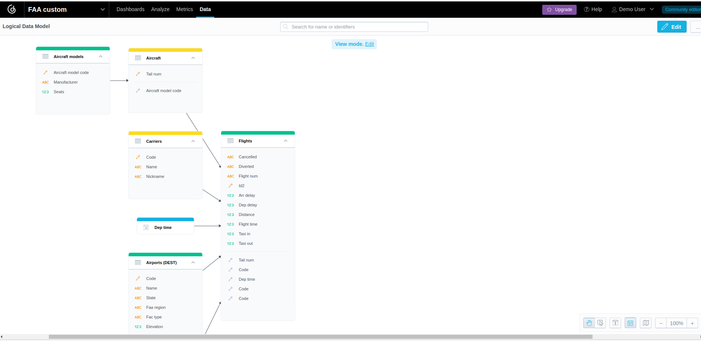
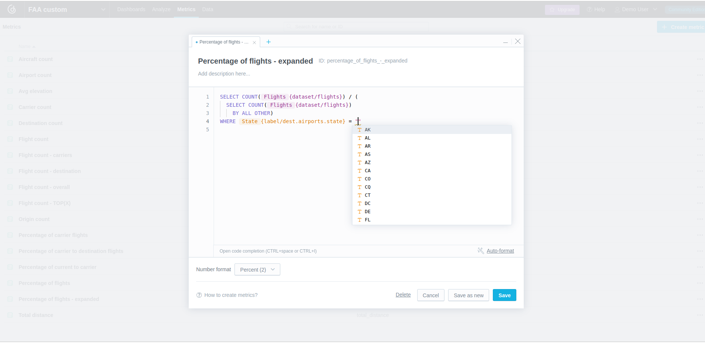
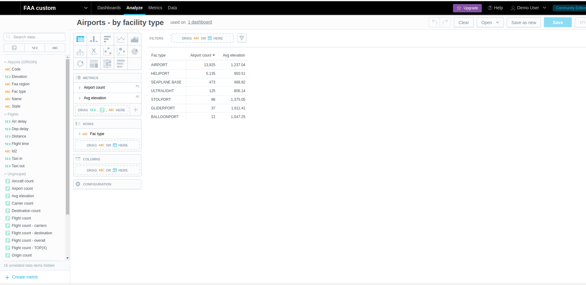

# Compare Looker Malloy with GoodData.CN MAQL

Looker Malloy is experimental open source language:
- [Github](https://github.com/looker-open-source/malloy)
- [Documentation](https://looker-open-source.github.io/malloy/documentation/) 

GoodData.CN is closed source analytics platform providing MAQL language:
- [Platform documentation](https://www.gooddata.com/developers/cloud-native/doc/2.2?utm_medium=blogpost&utm_source=medium.com&utm_campaign=gooddata_maql_malloy&utm_content=autor_jacek)
- [MAQL documentation](https://www.gooddata.com/developers/cloud-native/doc/2.2/create-metrics/maql/?utm_medium=blogpost&utm_source=medium.com&utm_campaign=gooddata_maql_malloy&utm_content=autor_jacek)
- The language is supported by so-called [Logical Data Model(LDM)](https://www.gooddata.com/developers/cloud-native/doc/2.1/model-data/create-ldm/?utm_medium=blogpost&utm_source=medium.com&utm_campaign=gooddata_maql_malloy&utm_content=autor_jacek)

Both languages can be used for writing even complex metrics(measures) in a way which is much more simple and maintainable than SQL.

There is also GoodData.CN SaaS offering available and this demo can be easily deployed there.
Just register to [trial](https://www.gooddata.com/trial/?utm_medium=blogpost&utm_source=medium.com&utm_campaign=gooddata_maql_malloy&utm_content=autor_jacek).

## Comparing incomparable
While Malloy is an experimental analytics language providing an infrastructure for simple report executions,
GoodData is a complete platform providing much more use cases, e.g.:
- Support for [many data sources](https://www.gooddata.com/developers/cloud-native/doc/2.2/connect-data/supported/?utm_medium=blogpost&utm_source=medium.com&utm_campaign=gooddata_maql_malloy&utm_content=autor_jacek) and so-called [data source managers](https://www.gooddata.com/developers/cloud-native/doc/2.2/connect-data/data-source-managers/?utm_medium=blogpost&utm_source=medium.com&utm_campaign=gooddata_maql_malloy&utm_content=autor_jacek)
- [User management and authentication (OIDC), permissions](https://www.gooddata.com/developers/cloud-native/doc/2.2/manage-deployment/&utm_source=medium.com&utm_campaign=gooddata_maql_malloy&utm_content=autor_jacek)
- [Embedding](https://www.gooddata.com/developers/cloud-native/doc/2.2/embed-visualizations/&utm_source=medium.com&utm_campaign=gooddata_maql_malloy&utm_content=autor_jacek)
- [Multi-tenancy](https://www.gooddata.com/developers/cloud-native/doc/2.2/manage-deployment/manage-workspaces/workspaces-layout/&utm_source=medium.com&utm_campaign=gooddata_maql_malloy&utm_content=autor_jacek)
- [Cache management](https://www.gooddata.com/developers/cloud-native/doc/2.2/connect-data/cache-management/&utm_source=medium.com&utm_campaign=gooddata_maql_malloy&utm_content=autor_jacek)

However, in this demo I focus on modelling, metrics and report executions, where it makes sense to compare Malloy with GoodData. 

## Conclusion
I am going to link a related article here with more details.

Long story short, I conclude:
- The semantic of models and metrics and reports is almost the same
  - I want to start discussing it with Malloy developers
  - We should (at least) open source interpreters of our languages (ideally under Apache license) so we can translate from one to another
- Malloy is IDE centric while GoodData is UI centric
  - We GoodData are going to focus on developer experience in near future
- Malloy does not support multi fact approach in metrics
  - [Already observed by PowerBI devs](https://datamonkeysite.com/2022/09/13/multi-fact-support-in-dax-and-malloy/)
- GoodData does not support computed attributes, e.g. CONCAT(first_name, " ", surname) 
  - It's on our roadmap

## Setup environment

### Malloy
Malloy's examples are very nice, so I decided to utilize them. 
[Here](https://github.com/looker-open-source/malloy#try-the-malloy-vscode-extension) you can find how to download and use Malloy vscode plugin and sample models. 
I decided to use the FAA data model, which includes data (PARQUET files) as well.

For instance, open [2_flights.malloy](malloy/2_flights.malloy) in vscode and click on "Run" inside the source code (before each "query" section).
Malloy generates SQL query and executes it using [DuckDB](https://duckdb.org/docs/) database against the PARQUET files.
The result is displayed in the right panel. You can also switch view to JSON or SQL.


### GoodData

The platform can be started as single docker container, but it must connect to a data source.
I decided to utilize the PostgreSQL database embedded in the GoodData container.
There is [docker-compose.yaml](./docker-compose.yaml) file for this purpose.
In the root folder, run:
```shell
docker-compose up -d
# In separate terminal window, you can watch docker logs by executing:
docker-compose logs --tail=10 -f
# Or you can use the helper scripts `dcc` and `dl` in the root directory
```
It should start in circa 2 minutes depending on your laptop hardware, at least 8G RAM is recommended.
It starts in 1 minute on my 32G/16threads Ryzen laptop. It should work on Apple Silicon as well. 

The Malloy sample data (PARQUET files) are loaded by the side-container defined in the `docker-compose.yaml`.
Also, GoodData models, metrics, insights(reports) and dashboards are loaded into the GoodData container.

You can go to [http://localhost:3000](http://localhost:3000), login with `demo@example.com` and `demo123`, and immediately start playing with the demo. 
In the UI, switch workspace to `FAA custom`.


 There are three dashboards representing the following three Malloy sample files:
- [1_airports.malloy](malloy/1_airports.malloy)
- [2_flights.malloy](malloy/2_flights.malloy)
- [3_carrier_analysis.malloy](malloy/3_carrier_analysis.malloy)

The related documentation can be found here:
- [Model Data](https://www.gooddata.com/developers/cloud-native/doc/2.2/model-data/&utm_source=medium.com&utm_campaign=gooddata_maql_malloy&utm_content=autor_jacek)
- [Metrics](https://www.gooddata.com/developers/cloud-native/doc/2.2/create-metrics/&utm_source=medium.com&utm_campaign=gooddata_maql_malloy&utm_content=autor_jacek)
- [Insights(Visualizations)](https://www.gooddata.com/developers/cloud-native/doc/2.2/create-visualizations/&utm_source=medium.com&utm_campaign=gooddata_maql_malloy&utm_content=autor_jacek)
- [Dashboards](https://www.gooddata.com/developers/cloud-native/doc/2.2/create-dashboards/&utm_source=medium.com&utm_campaign=gooddata_maql_malloy&utm_content=autor_jacek)

#### ENV variables

ENV variables affect where GoodData instance and the database containing the sample FAA data are running:
```shell
# Default pointing to your locally running GoodData community edition and its embedded PostgreSQL database
source .gd_credentials

# Create a custom file .custom_gd_credentials pointing to other than default organization 
# .custom_*_credentials is ignored by git
source .custom_gd_credentials

# Example content of the custom file for GoodData SaaS (cloud) offering
export TIGER_ENDPOINT="https://demo-cicd.cloud.gooddata.com"
export TIGER_API_TOKEN="xxx"
# Override where the database containing the sample FAA data is running
export DB_HOST="xxx.yyy.eu-central-1.rds.amazonaws.com"
export DB_NAME="gooddata"
export DB_USER="demo"
export DB_INPUT_SCHEMA="faa_input"
export DB_OUTPUT_SCHEMA="faa"
export DB_PASSWORD="xxx"
export DATA_SOURCE_ID="cust_demos_faa"
export DATA_SOURCE_NAME="Customer demos - FAA"
```

## How I built the GoodData solution for the Malloy FAA sample

Generally, I started with local Community Edition and developed everything there.
I created some artefacts in UI apps and synced their metadata to disk (described in the following chapters).

Once the complete solution was done and synced to disk, 
I linked(symlink) [default](gooddata/goodata_layouts/default) folder to [demo-cicd](gooddata/demo-cicd/goodata_layouts/demo-cicd).
Then I created the corresponding organization(domain) in our SaaS, [reset ENV variables](#env-variables) accordingly and delivered the whole solution from the disk folder to this domain.

TODO - Github actions pipeline delivering automatically into `demo-cicd` environment.

### Data load

I prepared [load_faa_postgres.py](gooddata/load_faa_postgres.py) script, which:
- Transforms PARQUET files into CSV files, because it is not easy to load PARQUET files into PostgreSQL database
  - We could load PARQUET files directly into other supported databases like Snowflake, Vertica, ...
  - I had to remove some rows from `flights` table, because they violate the referential integrity 
- Creates tables
- Loads CSV files into tables

I loaded the data into community edition first (default).
Later, when I validated the whole solution, I [reset the ENV variables](#env-variables) and loaded data into AWS RDS.

Based on the Malloy examples, I need to add the column `name` concatenating `code` and `full_name` in `airports` table.
GoodData does not support declaration of such computed attributes yet out of the box.
So I prepared a transformation layer using [dbt](https://www.getdbt.com/), everything related is stored in [transform](gooddata/transform) folder.

### Model

In [gooddata](gooddata) folder, I created python virtual env, and installed required libs:
```shell
cd gooddata
python -m venv .venv
source .venv/bin/activate
pip install -r requirements.txt
```

Then I bootstrap GoodData model using [bootstrap_model.py](gooddata/bootstrap_model.py) script:
```shell
./bootstrap_model.py
```

Note: all scripts interacting with GoodData instance utilize [GoodData Python SDK](https://github.com/gooddata/gooddata-python-sdk).

Specifically, the following steps are managed:
- PostgreSQL data source is registered in GoodData
- Database metadata(tables, columns) are collected and stored in GoodData (we cache it, because querying database catalogues is slow)
- Logical Data Model(LDM) is generated from physical model

Complete GoodData metadata are stored in [gooddata_layouts](gooddata/gooddata_layouts) folder:
- `default` folder represents the GoodData instance, resp. the organization(default) connected to domain(http://localhost:3000).
  - `data_sources` folder contains metadata about the registered PostgreSQL database and its table/column metadata
  - `workspaces` folder contain LDM and analytics model(metrics, insights, dashboards)

**But nothing is perfect** ;-) 

The generation of the Logical Data Model(LDM) is driven by physical databases properties (data types, referential integrity).
Specifically, we generate attributes from all INT columns.
But in real world, some INT columns can be attributes but some can facts.
Also, we do not support(not yet) 2+ foreign keys referencing the same table, flights -> airports(origin, dest) in this model.
It is necessary to polish the model.

What I did for you:
- I copied `faa` workspace to `faa_custom`
- I created two `airports` datasets (origin, dest).
  - Now they cannot be mapped to single table(airports), but it was already fixed and will be released soon. 
  - The data loader script creates two views on top of airports table
  - The datasets are mapped to the corresponding views.
- I updated INT columns generated as attributes to facts where it made sense
- I removed attributes/facts, which are not used in the Malloy's metric/report examples to keep the model simple
  - But the physical data model (the cache of metadata in GoodData) contains all columns, so it is easy to extend the logical data model by new entities and map them to not yet mapped physical columns

Once the new model was ready, I deployed it using the [put_workspace_faa_custom.py](gooddata/put_workspace_faa_custom.py) script.

The model can be also managed using GoodData LDM Modeler UI application:


### Metrics
I created metrics using the `Metric Editor` UI application. It provides complete intellisense:
- Language keywords like `SELECT` or `WHERE` are suggested in right places
- Entities (attributes, facts, metrics) are suggested in right places
  - e.g. inside SUM() only facts are suggested
- Filter values are suggested in right places, e.g. `WHERE country = "<here existing country values are suggested>"`


To keep the repository up-to-date, I created the [store_analytics.py](gooddata/store_analytics_faa_custom.py) script -
it stores the state of the analytics model(metrics, insights, dashboards) from the GoodData instance into the local folder [gooddata_layouts](gooddata/gooddata_layouts).

### Reports
Malloy calls them `queries`, GoodData calls them `insights`.
I built them using Analytical Designer UI app, which provides a nice drag&drop experience supporting self-service for business users.


## Jupyter notebook
I also prepared a Jupyter notebook to demonstrate the headless BI approach - 
entities from the semantic model can be reused by any clients.

Run jupyter in the `gooddata` folder:
```shell
jupyter notebook
```

Open the file [execute_report.ipynb](gooddata/execute_report.ipynb) and run cells (run them all one by one):
There are two use cases:
- compose the report from metrics and attributes(labels)
- execute the already stored report (insight)
