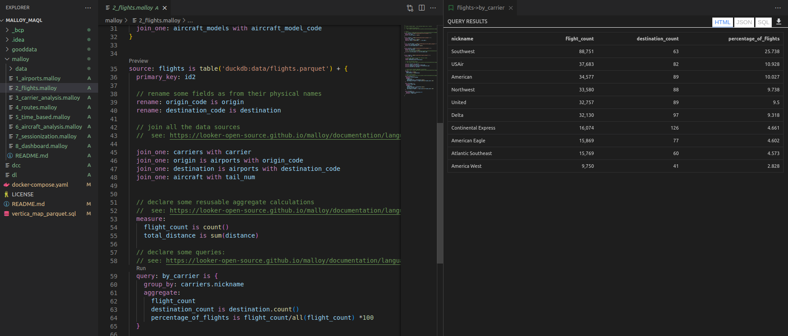

# Compare Looker Malloy with GoodData.CN MAQL

Looker Malloy is experimental open source language:
- [Github](https://github.com/looker-open-source/malloy)
- [Documentation](https://looker-open-source.github.io/malloy/documentation/) 

GoodData.CN is closed source analytics platform providing MAQL language:
- [Platform documentation](https://www.gooddata.com/developers/cloud-native/doc/2.1)
- [MAQL documentation](https://www.gooddata.com/developers/cloud-native/doc/2.1/create-metrics/maql/)
- The language is supported by so-called [Logical Data Model(LDM)](https://www.gooddata.com/developers/cloud-native/doc/2.1/model-data/create-ldm/)

Both languages can be used for writing even complex metrics(measures) in a way which is much more simple and maintainable than SQL.

## Setup environment

### Malloy
Malloy's examples are very nice, so I decided to utilize them. 
[Here](https://github.com/looker-open-source/malloy#try-the-malloy-vscode-extension) you can find how to download and use Malloy vscode plugin and sample models. 
I decided to use the FAA data model, which includes data (PARQUET files) as well.

### GoodData
The platform can be started as single docker container, but it must connect to a data source.
I decided to utilize Vertica database, because it can be started as a docker container locally, and it is easy to map external PARQUET files into this database.
There is [docker-compose.yaml](./docker-compose.yaml) file for this purpose.
In the root folder, run:
```shell
./dcc up -d gooddata-cn-ce vertica
# or start all
./dcc up -d
```

To map Malloy example PARQUET files, connect to Vertica from your favorite SQL IDE and run SQL statements from [vertica_map_parquet.sql](./gooddata/vertica_map_parquet.sql) file.
DB connection properties:
- jdbc URL = `jdbc:vertica://localhost:5433/verticadb`
- user = malloy
- password = malloy123

## How to execute reports
Malloy names reports as `queries`, GoodData name them `insights`.

### Malloy
Just open e.g. [2_flights.malloy](malloy/2_flights.malloy) in vscode and click on "Run" inside the source code (before each "query" section).
Malloy generates SQL query and executes it using [DuckDB](https://duckdb.org/docs/) database against the PARQUET files.
The result is displayed in the right panel. You can also switch view to JSON or SQL.



### GoodData
Go to "gooddata" folder, create python virtual env, and install required libs:
```shell
cd gooddata
python -m venv .venv
source .venv/bin/activate
pip install -r requirements.txt
```

Set ENV variables needed for connection to GoodData platform:
```shell
source .gd_credentials
```

Now you can bootstrap GoodData using [bootstrap.py](gooddata/bootstrap.py) script:
```shell
./bootstrap.py
```
Specifically, the following steps are managed:
- Vertica data source is registered in GoodData
- Database metadata(tables, columns) are collected and stored in GoodData (cache, querying database catalogues is slow)
- Logical Data Model(LDM) is generated from physical model

Complete GoodData metadata are stored in [gooddata_layouts](gooddata/gooddata_layouts) folder:
- `default` folder represents the GoodData instance, resp. the organization(domain).
  - `data_sources` folder contains metadata about the registered Vertica database and its table/column metadata
  - `workspaces` folder contain LDM and analytics model(metrics, insights, dashboards)

Now you could go to [http://localhost:3000](http://localhost:3000), login with `demo@example.com` and `demo123`, pick `FAA` workspace, and start building metrics, reports(insights) and dashboards. The related documentation can be found here:
- [Metrics](https://www.gooddata.com/developers/cloud-native/doc/2.1/create-metrics/)
- [Insights(Visualizations)](https://www.gooddata.com/developers/cloud-native/doc/2.1/create-visualizations/)
- [Dashboards](https://www.gooddata.com/developers/cloud-native/doc/2.1/create-dashboards/)

You can also learn more about the model:
- [Model Data](https://www.gooddata.com/developers/cloud-native/doc/2.1/model-data/)

**But nothing is perfect**. 

The generated default model is not good-enough. I customized it(see [customizations](#customizations) for more details), and you can load it as a second workspace into GoodData:
```shell
./put_models.py
```
I prepared metrics and insights (and also dashboards) for the following Malloy's example files:
- [1_airports.malloy](malloy/1_airports.malloy)
- [2_flights.malloy](malloy/2_flights.malloy)
- [3_carrier_analysis.malloy](malloy/3_carrier_analysis.malloy)

In the UI, change workspace to `FAA custom` and enjoy it. 
Feel free to create new insights representing other Malloy's examples. 
Feedback is welcome!

### Customizations
The generation of the Logical Data Model(LDM) is driven by physical databases properties (data types, referential integrity).
Specifically, we generate attributes from all INT columns. 
But in real world, some INT columns can be attributes but some can facts. 
Also, we do not support(not yet) 2+ foreign keys referencing the same table, flights -> airports(origin, dest) in this model. 
It is necessary to polish the model.

What I did for you:
- I copied `faa` workspace to `faa_custom`
- I created two `airports` datasets (origin, dest). 
  - Now they cannot be mapped to single table(airports). It is necessary to run SQL statements from [vertica_airports_roles.sql](gooddata/vertica_airports_roles.sql). The datasets are mapped to the corresponding views.
- I updated INT columns generated as attributes to facts where it made sense
- I removed attributes/facts, which are not used in the Malloy's metric/report examples to keep the model simple

### Jupyter notebook
I also prepared a Jupyter notebook to demonstrate the headless BI approach - 
entities from the semantic model can be reused by any clients.

Run jupyter in the `gooddata` folder:
```shell
jupyter notebook
```

Open the file [execute_report.ipynb](gooddata/execute_report.ipynb) and run cells.
There are two use cases:
- compose the report from metrics and attributes(labels)
- execute the already stored report (insight)
